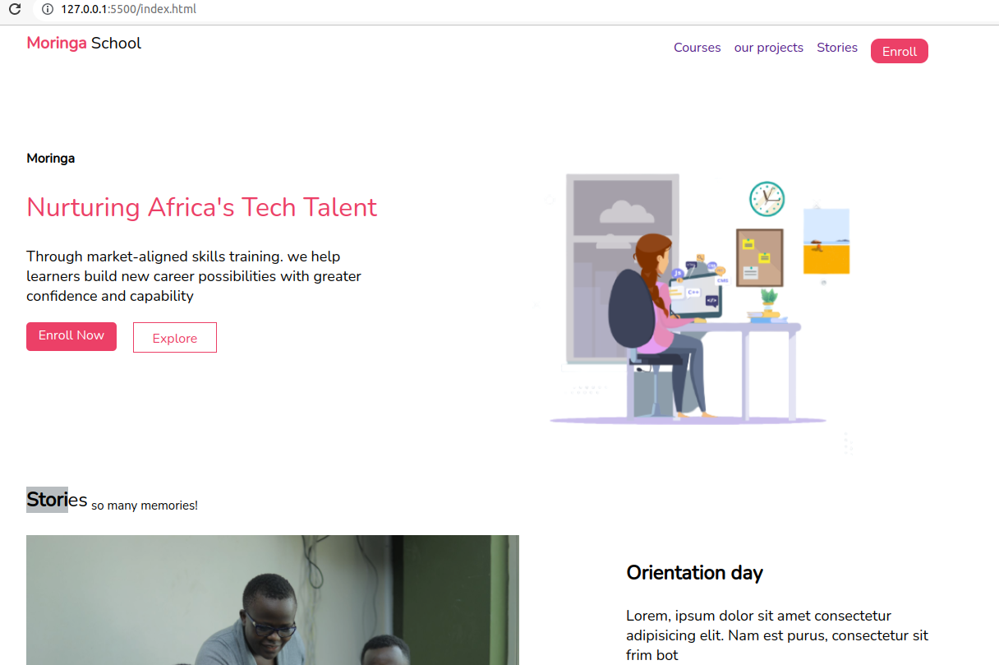

# Moringa-school-landing-Page
***


Moringa landing page is a well designed website that displays the variety of important features of a tech school from its staff,
to naturing youths in Kenya.

## Demo
Here is a working demo of this landing page: https://jobsidney.github.io/Moringa-school-landing-page/

***
## The Site
## [Usage](https://jobsidney.github.io/Moringa-school-landing-page/) 



### Development & contributions

Do you want to make it better?
the following are the process to show your contribution to this page:

- Fork the repo
- Create a new branch (`git checkout -b contribute`).
- Make the changes you want to the files and folders.
- Add the changes (`git add .`).
- to reflect the changes.
- commit changes (`git commit -m 'Contributing new featires'`).
- push changes to the branch (`git push origin contribute`).
- Do a pull Request.
  


## [Features](https://jobsidney.github.io/Moringa-school-landing-page/)

- Uses HTML5
- Well arranged and designed User Interface(UI).
- Css selectors uses classes that are reusable hence small but reliable codes.
- Easy navigation to multiple pages via links.
  

## To-do list
- Add interactive features using JavaScript
- Code a good backend using Golang or Ruby and APIs
- Link it to other important website on complition
  
### Code sample
#### Html
```Html
<div class="imageTitle">
                <section class="wordSection">
                <strong>Board meeting</strong><br><br>
                <div>
                    Lorem, ipsum dolor sit amet consectetur adipisicing elit. Nam est purus, consectetur sit frim bot
                </div><br>
                <div class="Navi2"><span class="menuLink2">
                    <a href="">See Album</a></span></div></section>
            </div>
```

#### Css
    Example of Css class (Navi2)
```Css
.Navi2{
    width: 100px;
    height: 25px;
    background-color: #EC4067;
  
    text-align: center;
    color: white;
    font-weight: 200;
    border-radius: 5px;
    margin-right: 20px;
    padding: 5px;
}
```
## Contributers
- [Jobsidney](https://github.com/Jobsidney/)
  
